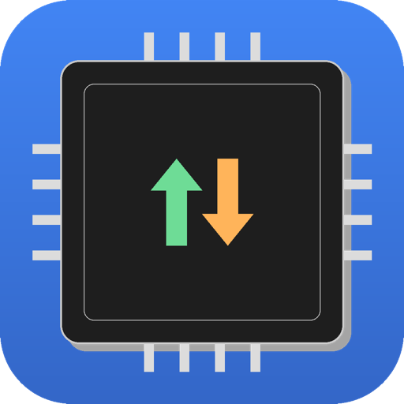
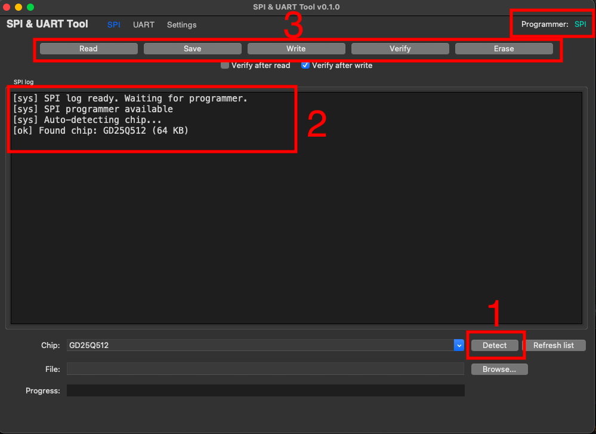
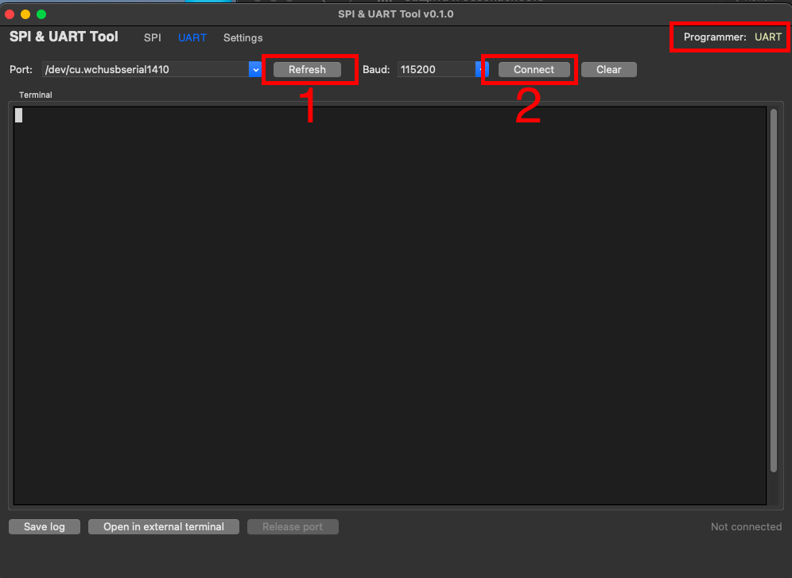
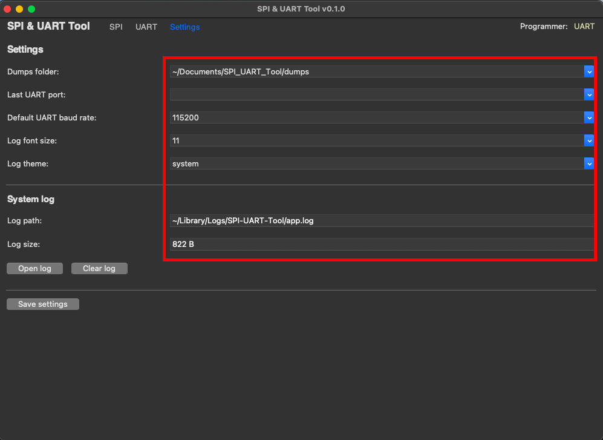
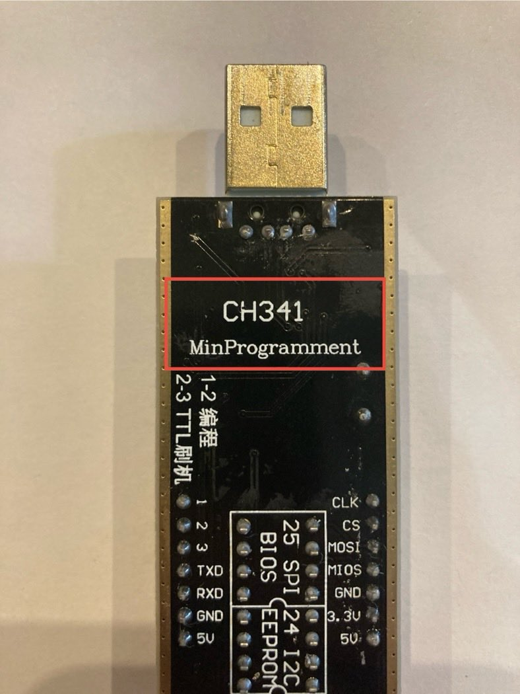
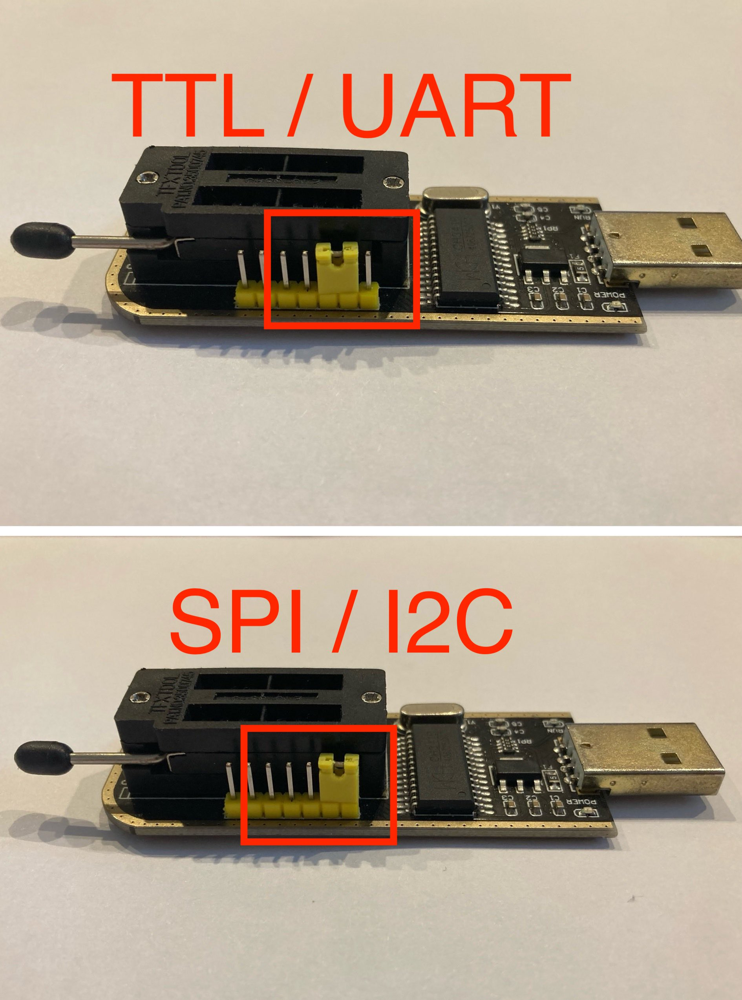
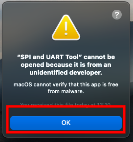
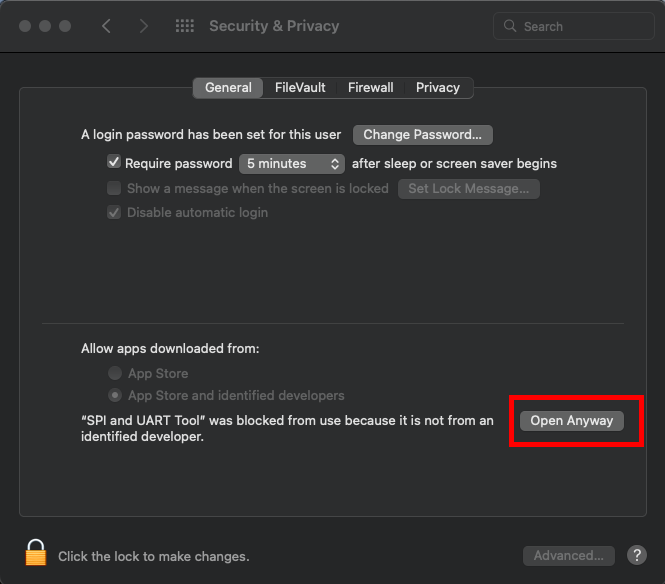
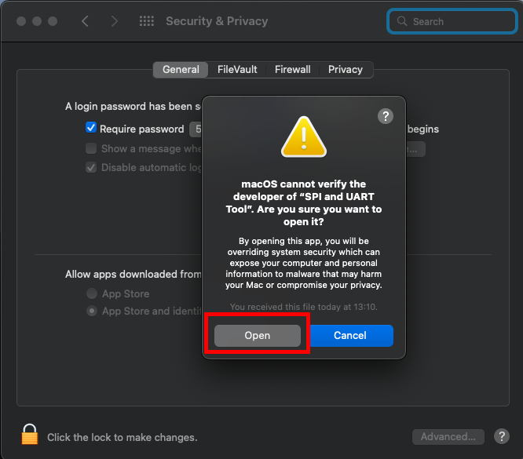

<p align="center">
  
</p>

<h1 align="center">SPI & UART Tool</h1>

<p align="center">
  A macOS GUI tool for working with SPI flash chips and UART devices.<br>
  A native graphical wrapper around <b>flashrom</b> and <b>pyserial</b>.
</p>

<p align="center">
  
  
  
  
</p>

---

## What it is

A macOS desktop application that replaces manual `flashrom` and `screen` terminal commands with a native graphical interface. Built for working with SPI flash chips and UART devices through a CH341A-based programmer.

- **SPI operations** are powered by [flashrom](https://www.flashrom.org/) (libflashrom).
- **UART terminal** is powered by [pyserial](https://github.com/pyserial/pyserial) and [pyte](https://github.com/selectel/pyte).
- **USB hotplug** is handled by [usb-plug-notification-darwin](https://github.com/kor3n4n/usb-plug-notification-darwin).

## Screenshots

### SPI tab


### UART tab


### Settings tab


## Tested on

> ⚠️ **Built and tested only on macOS Monterey (Intel Mac).** Compatibility with other macOS versions and Apple Silicon is not guaranteed.

- **OS:** macOS Monterey (Intel)
- **Programmer:** CH341A-based device
  - USB VID: `0x1A86`
  - USB PID: `0x5512`




## Features

### SPI flash programmer

- Auto-detect chip (with name and size)
- Read dump to file (with real-time progress)
- Write dump from file
- Verify chip against file
- Erase chip
- SHA256 hash for dumps
- Auto-verify after read / write (optional)
- Support for 705+ chips (via libflashrom)

### UART terminal

- Auto-detect available serial ports
- Connect at any baud rate
- Full terminal emulation (with scrollback history)
- Send / receive data
- Copy / paste support
- Save terminal log to file
- Open in external Terminal.app (via screen)

### General

- USB hotplug detection (SPI / UART mode, no restart needed)
- Programmer mode indicator in toolbar
- Settings persistence (JSON config)
- System log with rotation
- Dark log theme (like a terminal)

## Requirements

- macOS Monterey (Intel) — tested; other versions not verified
- [CH340 driver](http://www.wch.cn/downloads/CH341SER_MAC_ZIP.html) (only for UART mode)
- CH341A programmer (or compatible CH341-family device)
- SPI flash chip (for SPI operations)

## Installation

### For users

Download the latest `.zip` from the [Releases](https://github.com/psevdonim-web/spi-uart-tool/releases) section.

1. Unpack `SPI and UART Tool.app` to `/Applications` (or any folder)
2. Install CH340 driver (only for UART mode)
3. On first launch, macOS Gatekeeper will block the app (see below)

### First launch on macOS

This app is **not signed or notarized by Apple**. On first launch, macOS Gatekeeper will block it.

**Step 1** — You will see this warning:



**Step 2** — Open **System Settings → Privacy & Security**, scroll down and click **Open Anyway**:



**Step 3** — Confirm in the final dialog by clicking **Open**:



You only need to do this once. macOS will remember your choice.

### For developers

Build from source.

**Step 1.** Install dependencies via Homebrew:

```
brew install python@3.14 flashrom tcl-tk
```

**Step 2.** Clone repository:

```
git clone https://github.com/psevdonim-web/spi-uart-tool.git
cd spi-uart-tool
```

**Step 3.** Create virtual environment:

```
python3 -m venv venv
source venv/bin/activate
```

**Step 4.** Install Python dependencies:

```
pip3 install pyserial pyte usb-plug-notification-darwin py2app
```

**Step 5.** Run from source:

```
venv/bin/python main.py
```

**Step 6.** Build `.app`:

```
rm -rf build dist
python3 setup.py py2app
```

## Usage

### SPI

1. Insert SPI flash chip into CH341A socket (make sure **3.3V**, not 5V!)
2. Set jumper to SPI mode
3. Connect CH341A to Mac
4. Open SPI tab, press **Detect** — chip name appears
5. Press **Read** to read chip into memory
6. Press **Save** to save dump to file
7. Press **Write** to write file to chip (with confirmation)
8. Press **Verify** to verify chip against file
9. Press **Erase** to erase chip (with confirmation)

### UART

1. Set jumper to UART mode
2. Connect CH341A to Mac
3. Open UART tab, select port, press **Connect**
4. Type commands in the terminal
5. Press **Save log** to save terminal output
6. Press **Open in external terminal** to use `screen` in Terminal.app

## Safety notes

- CH341A must be set to **3.3V**, NOT 5V. 5V can damage SPI chips.
- Disconnect the target device from power before reading or writing SPI.
- **Write** and **Erase** operations are destructive. Make sure you have a backup.
- **Verify after write** is enabled by default. Keep it on to ensure data integrity.

## Known issues

- Hotplug (SPI/UART switch) may not trigger on the first attempt
- Occasional replacement characters (U+FFFD) in UART output
- Minor visual glitches during window resize (500 ms debounce)

## License

This project is licensed under the **GNU General Public License v3.0 (GPLv3)**.

It uses libflashrom (GPLv2), which is compatible with GPLv3.

See [LICENSE](LICENSE) file for details.

## Author

**Sushkov Yan** ([@psevdonim-web](https://github.com/psevdonim-web))

## Acknowledgments

- [flashrom](https://www.flashrom.org/) — for the excellent SPI programming library
- [pyte](https://github.com/selectel/pyte) — for terminal emulation
- [pyserial](https://github.com/pyserial/pyserial) — for serial port communication
- [usb-plug-notification-darwin](https://github.com/kor3n4n/usb-plug-notification-darwin) — for USB hotplug notifications